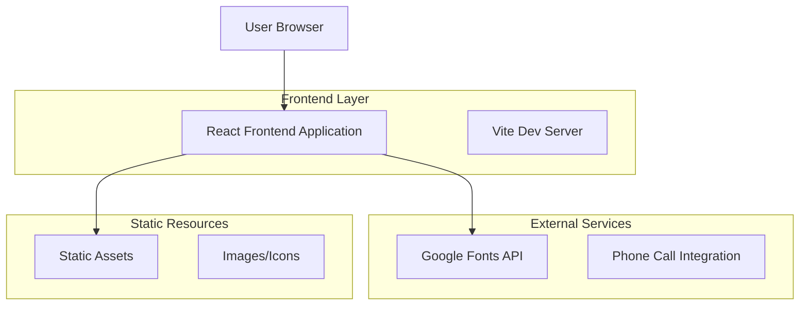

# Pro Service Auto - Documento de Arquitectura Técnica

## 1. Architecture design



## 2. Technology Description

* Frontend: React\@18 + Vite\@5 + CSS3

* Styling: CSS Modules + Google Fonts (Inter)

* Build Tool: Vite (desarrollo y producción)

* Package Manager: pnpm

* Deployment: Static hosting compatible

## 3. Route definitions

| Route      | Purpose                                                                              |
| ---------- | ------------------------------------------------------------------------------------ |
| /          | Página principal con header, banner promocional, hero section y preview de servicios |
| /servicios | Página de servicios detallados con precios y especialidades                          |
| /conocenos | Página sobre el taller, equipo y experiencia                                         |
| /contacto  | Página de contacto con formulario y información de ubicación                         |

## 4. Component Architecture

### 4.1 Component Structure

```
src/
├── components/
│   ├── Header/
│   │   ├── Header.jsx
│   │   ├── Header.module.css
│   │   └── Navigation.jsx
│   ├── Banner/
│   │   ├── PromoBanner.jsx
│   │   ├── PromoBanner.module.css
│   │   └── CountdownTimer.jsx
│   ├── Hero/
│   │   ├── HeroSection.jsx
│   │   └── HeroSection.module.css
│   ├── Services/
│   │   ├── ServicesPreview.jsx
│   │   ├── ServiceCard.jsx
│   │   └── Services.module.css
│   └── Contact/
│       ├── ContactForm.jsx
│       └── ContactForm.module.css
├── pages/
│   ├── Home.jsx
│   ├── Services.jsx
│   ├── About.jsx
│   └── Contact.jsx
├── hooks/
│   └── useCountdown.js
├── utils/
│   └── constants.js
└── assets/
    └── images/
```

### 4.2 Key Components

**Header Component**

* Logo de Pro Service Auto

* Navegación responsive (desktop/mobile)

* Integración con React Router

**PromoBanner Component**

* Countdown timer funcional

* Botón de llamada directa

* Responsive design

**HeroSection Component**

* Imagen de fondo optimizada

* Overlay con gradiente

* Call-to-action principal

**CountdownTimer Hook**

* Custom hook para manejo del countdown

* Actualización en tiempo real

* Formato de días, horas, minutos, segundos

## 5. Styling Architecture

### 5.1 CSS Structure

```css
/* Global Variables */
:root {
  --primary-yellow: #fad722;
  --primary-black: #000000;
  --white: #ffffff;
  --gray-text: #666666;
  --font-family: 'Inter', sans-serif;
}

/* Typography Scale */
.heading-xl { font-size: 3.5rem; font-weight: 700; }
.heading-lg { font-size: 2.5rem; font-weight: 600; }
.heading-md { font-size: 1.5rem; font-weight: 500; }
.body-lg { font-size: 1.125rem; font-weight: 400; }
.body-md { font-size: 1rem; font-weight: 400; }
```

### 5.2 Responsive Breakpoints

```css
/* Mobile First Approach */
@media (min-width: 768px) { /* Tablet */ }
@media (min-width: 1024px) { /* Desktop */ }
@media (min-width: 1280px) { /* Large Desktop */ }
```

## 6. Performance Optimization

### 6.1 Image Optimization

* Imágenes en formato WebP con fallback

* Lazy loading para imágenes below-the-fold

* Responsive images con srcset

### 6.2 Font Loading

* Preconnect a Google Fonts

* Font-display: swap para evitar FOIT

* Subset de caracteres latinos

### 6.3 Code Splitting

* Lazy loading de páginas con React.lazy()

* Suspense boundaries para mejor UX

* Chunk optimization con Vite

## 7. Browser Support

* Chrome 90+

* Firefox 88+

* Safari 14+

* Edge 90+

* Mobile browsers (iOS Safari 14+, Chrome Mobile 90+)

## 8. Development Workflow

### 8.1 Development Commands

```bash
# Desarrollo
npm run dev

# Build para producción
npm run build

# Preview del build
npm run preview

# Linting
npm run lint
```

### 8.2 File Structure Best Practices

* Componentes en PascalCase

* Archivos CSS con módulos para evitar conflictos

* Hooks personalizados con prefijo 'use'

* Constantes en archivo separado

* Assets organizados por tipo

## 9. SEO and Accessibility

### 9.1 SEO Optimization

* Meta tags apropiados

* Structured data para negocio local

* Sitemap.xml

* Robots.txt

### 9.2 Accessibility

* Semantic HTML

* ARIA labels donde sea necesario

* Contraste de colores WCAG AA

* Navegación por teclado

* Screen reader compatibility

