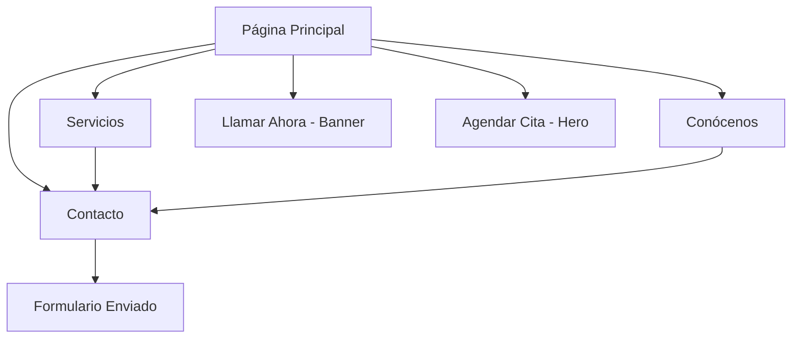

# Pro Service Auto - Documento de Requerimientos del Producto

## 1. Product Overview
Pro Service Auto es una plataforma web para un taller automotriz que ofrece servicios de diagnóstico, reparación y mantenimiento vehicular. El sitio web busca generar confianza y facilitar la comunicación con clientes potenciales a través de un diseño profesional y llamadas a la acción claras.

El objetivo es convertir visitantes en clientes mediante una experiencia web optimizada que destaque la calidad del servicio y facilite el agendamiento de citas.

## 2. Core Features

### 2.1 User Roles
No se requiere distinción de roles de usuario para esta versión inicial. Todos los visitantes tendrán acceso completo a la información y funcionalidades del sitio.

### 2.2 Feature Module
Nuestro sitio web de Pro Service Auto consta de las siguientes páginas principales:
1. **Página Principal**: header con navegación, banner promocional con countdown, hero section, secciones de servicios, testimonios y contacto.
2. **Página de Servicios**: detalle de servicios ofrecidos, precios y especialidades.
3. **Página Conócenos**: información sobre el taller, equipo y experiencia.
4. **Página de Contacto**: formulario de contacto, información de ubicación y horarios.

### 2.3 Page Details

| Page Name | Module Name | Feature description |
|-----------|-------------|---------------------|
| Página Principal | Header Navigation | Navegación principal con logo, menú (INICIO, SERVICIOS, CONÓCENOS, CONTACTO) |
| Página Principal | Promotional Banner | Banner superior con countdown timer para promoción del Día del Padre y botón "Llamar Ahora" |
| Página Principal | Hero Section | Sección principal con título, subtítulo, botón "Agendar Cita" y imagen de fondo de auto deportivo |
| Página Principal | Services Preview | Vista previa de servicios principales con precios desde $40 |
| Página Principal | Contact CTA | Sección de llamada a la acción para contacto y agendamiento |
| Servicios | Services List | Lista detallada de servicios: diagnóstico, reparación, mantenimiento preventivo |
| Servicios | Pricing Table | Tabla de precios por tipo de servicio y complejidad |
| Conócenos | About Section | Historia del taller, misión, visión y valores |
| Conócenos | Team Section | Presentación del equipo técnico y certificaciones |
| Contacto | Contact Form | Formulario para solicitar información y agendar citas |
| Contacto | Location Info | Dirección, teléfono, horarios de atención y mapa |

## 3. Core Process

El flujo principal del usuario comienza en la página de inicio donde puede navegar por las diferentes secciones. Desde el hero section puede agendar una cita directamente, o explorar los servicios disponibles. El banner promocional permite contacto inmediato por teléfono. Los usuarios pueden conocer más sobre el taller y finalmente contactar para agendar servicios.

## 4. User Interface Design

### 4.1 Design Style
- **Colores primarios**: Amarillo #fad722 (botones y acentos), Negro #000000 (texto principal)
- **Colores secundarios**: Blanco #ffffff (fondos), Gris #666666 (texto secundario)
- **Tipografía**: Inter (Google Fonts) - pesos 400, 500, 600, 700
- **Estilo de botones**: Redondeados con esquinas suaves, efecto hover
- **Layout**: Diseño limpio y moderno, espaciado generoso, grid responsive
- **Iconos**: Iconos minimalistas relacionados con automoción

### 4.2 Page Design Overview

| Page Name | Module Name | UI Elements |
|-----------|-------------|-------------|
| Página Principal | Header | Logo blanco sobre fondo oscuro, navegación horizontal, tipografía Inter 500 |
| Página Principal | Promotional Banner | Fondo negro, texto blanco, countdown en amarillo #fad722, botón amarillo |
| Página Principal | Hero Section | Imagen de fondo de auto deportivo amarillo, overlay oscuro, texto blanco, botón amarillo prominente |
| Página Principal | Services Preview | Cards con fondo blanco, bordes sutiles, iconos amarillos, tipografía Inter |
| Servicios | Services List | Layout de grid, cards con hover effects, iconos representativos |
| Conócenos | About Section | Imágenes del taller, texto justificado, colores corporativos |
| Contacto | Contact Form | Campos con bordes amarillos al focus, botón de envío amarillo |

### 4.3 Responsiveness
El sitio es mobile-first con adaptación completa para desktop. Incluye navegación hamburger en móviles, reorganización de contenido en tablets y optimización táctil para todos los elementos interactivos.

## 5. Funcionalidades Especiales

### 5.1 Countdown Timer
Timer funcional en JavaScript que cuenta regresivamente hasta el 15 de junio para la promoción del Día del Padre, mostrando días, horas, minutos y segundos.

### 5.2 Call-to-Action Buttons
- Botón "Llamar Ahora" en el banner promocional
- Botón "Agendar Cita" en el hero section
- Enlaces de contacto distribuidos estratégicamente

### 5.3 Navegación Responsive
Menú adaptativo que se convierte en hamburger menu en dispositivos móviles, con animaciones suaves y accesibilidad optimizada.